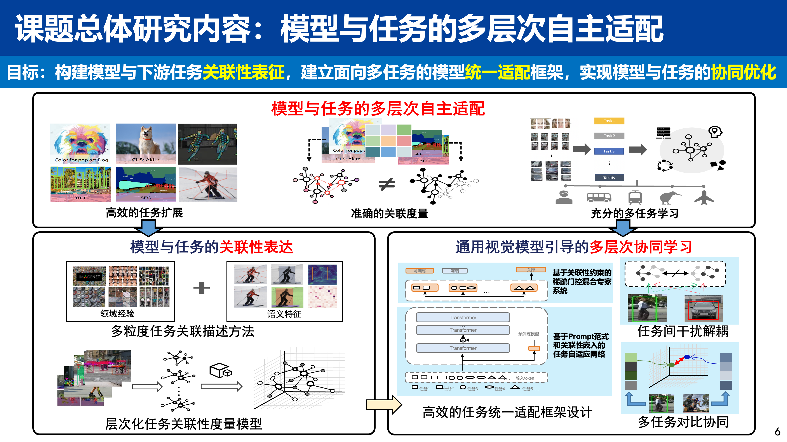
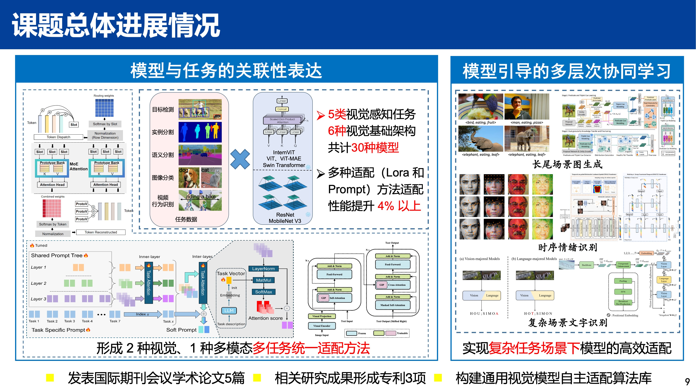
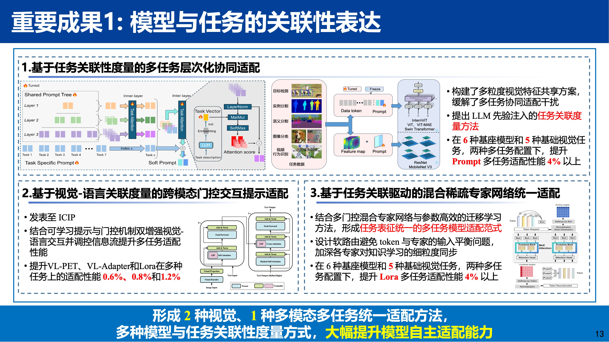
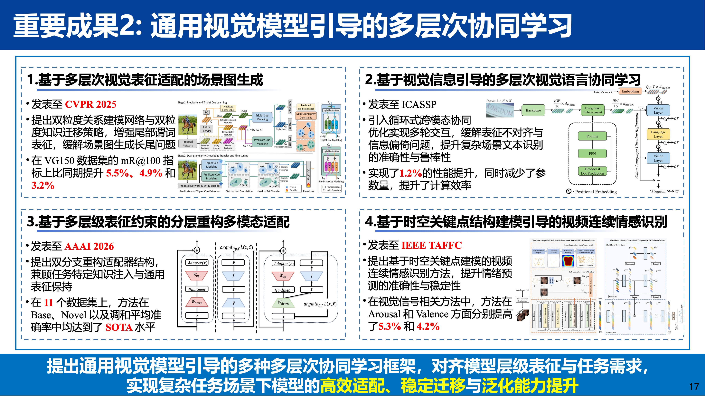

# Incomplete-Condition-Visual-Perception

**模型与任务的多层次自主适配** · Multi-level autonomous adaptation of models and tasks

本组织围绕「非完备条件视觉感知」技术体系，聚焦通用视觉模型在数据稀缺、标注成本高等非完备条件下向多样化下游任务的高效适配。研究涵盖**模型与任务的关联性表达**（多粒度任务关联、门控交互提示、混合稀疏专家等）与**通用视觉模型引导的多层次协同学习**（场景图生成、视觉-语言协同、分层重构适配等），在图像分类、视频行为识别、目标检测、语义分割、实例分割等 5 类任务及多种骨干网络上实现稳定性能提升。

## 课题概览

## 课题重要成果

## 开源成果

论文与项目代码见组织仓库：[**Repositories**](https://github.com/orgs/Incomplete-Condition-Visual-Perception/repositories)

| 仓库                                                                                              | 简介                                                                            | 课题子任务                       |
| ------------------------------------------------------------------------------------------------- | ------------------------------------------------------------------------------- | -------------------------------- |
| [PETL_Base_Framework](https://github.com/Incomplete-Condition-Visual-Perception/PETL_Base_Framework) | 多任务层次化协同适配、混合稀疏专家网络统一适配（任务关联性度量 / 任务关联驱动） | 模型与任务的关联性表达           |
| [GIP](https://github.com/Incomplete-Condition-Visual-Perception/GIP)                                 | 门控交互提示，视觉-语言参数高效微调（ICASSP）[2]                                | 模型与任务的关联性表达           |
| [RMAdapter](https://github.com/Incomplete-Condition-Visual-Perception/RMAdapter)                     | 谓词与三元组学习的场景图生成（AAAI 2026 Oral）[5]                               | 通用视觉模型引导的多层次协同学习 |
| [DRM](https://github.com/Incomplete-Condition-Visual-Perception/DRM)                                 | 场景图生成（CVPR 2024）[1]                                                      | 通用视觉模型引导的多层次协同学习 |

## 论文成果

1. Jiankai Li, Yunhong Wang, Xiefan Guo, Ruijie Yang, Weixin Li. *Leveraging Predicate and Triplet Learning for Scene Graph Generation* [C]. CVPR, 2024. (CCF A)
2. Taiwei Zhang, Zhenghui Hu, Weixin Li, Qingjie Liu, Yunhong Wang. *Read, Spell and Repeat: Scene Text Recognition with Vision-Language Circular Refinement* [C]. ICASSP, 2024.
3. Xiang Lin, Weixin Li, Shuo Guo, Lihong Wang, Di Huang. *GIP: Gated Interaction Prompt for Parameter Efficient Vision-Language Fine-Tuning* [C]. ICIP, 2025.
4. Weixin Li, Xiangjing Meng, Linmei Hu, Xuan Dong. *Temporal Group Constrained Transformer with Deformable Landmark Attention for Video Dimensional Emotion Recognition* [J]. IEEE Transactions on Affective Computing, 2025 (Early Access). (CCF A)
5. Xiang Lin, Weixin Li, Shu Guo, Lihong Wang, Di Huang. *RMAdapter: Reconstruction-based Multi-modal Adapter for Vision-Language Models* [C]. AAAI, 2026. (CCF A)

## 专利

1. **一种基于混合稀疏专家网络的多任务适配方法**（申请号：202410694870.7），申请日期：2024.05，专利权人：北京航空航天大学、上海人工智能创新中心
2. **一种基于门控交互提示的视觉-语言模型的参数微调方法**（申请号：202511104231.1），申请日期：2025.08，专利权人：北京航空航天大学
3. **一种多粒度任务自适应共享的多任务协同适配方法**（申请号：202511559642.X），申请日期：2025.10，专利权人：北京航空航天大学

欢迎合作与引用。
